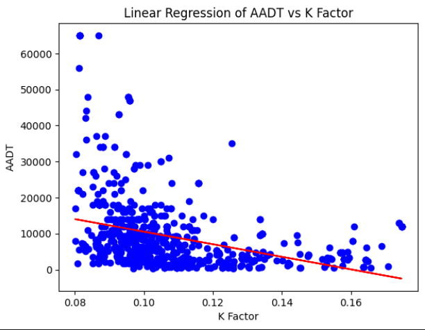

# AADT vs K Factor Research Project

## Purpose
This project examines the correlation between the K Factor and the Average Annual Daily Traffic (AADT) for road segments in Loudoun County, Virginia.

## Hypothesis
As the K Factor increases, AADT will also increase because a higher K Factor may indicate a more commercial or central road with heavier traffic volume.

## Background
AADT, or Average Annual Daily Traffic, measures the average number of vehicles traveling on a road each day over the course of a year. It is a common way to describe how heavily used a roadway is.

K Factor is a traffic engineering measure that describes what percentage of daily traffic occurs during the busiest hour. A higher K Factor means traffic is more concentrated during peak periods, which can be important when studying road demand, commuter patterns, and roadway planning.

This project uses K Factor as a simple predictor for AADT because both values come from traffic counts and may reflect how active a road segment is. The idea is that roads with stronger peak-hour demand may also have larger total daily traffic. However, traffic volume is usually influenced by more than one factor, so this relationship is expected to be limited when used alone.

## Procedure
1. Load the Loudoun County Excel dataset into pandas.
2. Remove unnamed columns from the spreadsheet.
3. Drop rows with missing values in the AADT and K Factor columns.
4. Build a smaller dataset using only K Factor and AADT.
5. Remove extreme outliers from both columns using the 3rd and 97th percentiles.
6. Fit a linear regression model with K Factor as the input and AADT as the output.
7. Evaluate the model using R-squared, Mean Squared Error, and Mean Absolute Error.
8. Plot the scatter data and the regression line to visualize the trend.

## Results
The model produced the following values:

- R-squared: 0.12709178456828307
- Mean Squared Error: 85828907.18922682
- Mean Absolute Error: 6226.485029575414

These results show that K Factor alone explains only a small part of the variation in AADT. The scatter plot still shows a moderately negative correlation in the fitted line after outlier removal, but the relationship is not strong enough for highly accurate prediction.

## Conclusion

The results suggest that as traffic volume increases, the K Factor tends to decrease. This is the opposite of the original hypothesis, which expected higher AADT to be associated with a higher K Factor. However, the relationship is weak, so K Factor alone does not fully explain the traffic pattern. Other factors, such as the number of lanes, connections to busier arterial roads, and higher population density, may also influence AADT.

### Ways to Improve Accuracy
- Use multiple linear regression instead of only one predictor.
- Add more roadway features such as speed limit, lane count, road type, functional classification, nearby land use, and population density.
- Try polynomial regression if the relationship is not perfectly linear.
- Compare linear regression with Ridge and Lasso regression to see whether regularization improves stability.
- Split the data into training and testing sets so the model is evaluated on unseen data.
- Standardize or transform skewed variables if the distribution is uneven.
- Investigate remaining outliers instead of removing them automatically.
- Add more sample data from additional road segments or multiple years.

## How To Set It Up
1. Install Python packages: pandas, openpyxl, matplotlib, and scikit-learn.
2. Keep the Excel file in the same folder as the notebook.
3. Open aadt.ipynb in VS Code or Jupyter.
4. Run the import and data-loading cells first.
5. Run the cleaning, modeling, and evaluation cells in order.
6. Run the chart cell to view the regression line.

